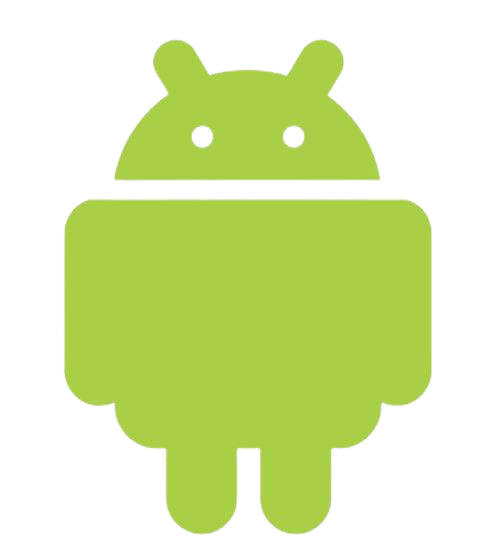

 

  

  <h3 align="center">Android Studio Project</h3>

  

    Modern programming platforms, laboratory practice 2022 
     
     
    <a href="https://github.com/bastep-s/SPP2022"><strong>Explore the docs »</strong></a>
     
     
  

    

## Authors

* **Tagashev Ivan** - *UlSTU* - [Tagashev Ivan](https://github.com/bastep-s) - *Build*
* **Egorov Ivan** - *UlSTU* - [Egorov Ivan](https://github.com/Doomaykaka) - *Build*
